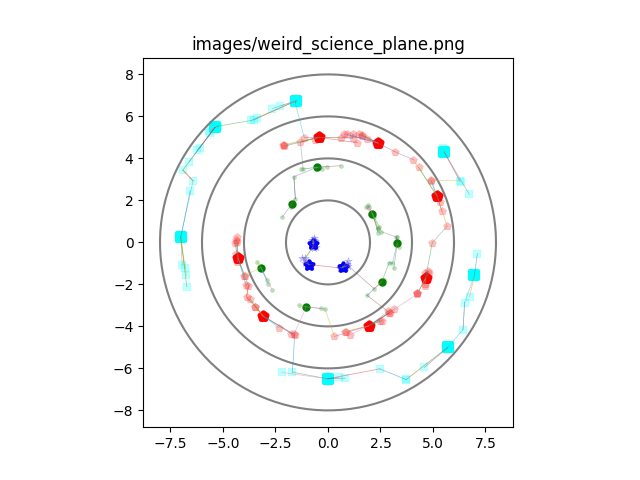

# Rattle Snake

Python library for generating interesting 
(at least according to my arbitrary criteria) points




## Setup

### pyenv
https://github.com/pyenv/pyenv/

### Poetry
https://python-poetry.org/

## installing dependencies

``` shell
poetry install
```

## How to run
For now try

``` shell
poetry run python -m rattle_snake.plane_map
```

which should generate an image in the images directory for a certain
plane of existence.

## Exporting 

Not yet implemented

## How are plane maps generated?

There are multiple planes of existence, one for each of the 3
cultures of beings from the [beings](https://github.com/joedaws/beings) simulation.
Each plane is made up of concentric circles corresponding to the different ranks
that beings might have. For each circle, there are two kinds of categories of nodes,
population centers and supporting nodes. 

**Node**
The locations of the population centers are generated by
randomly generating the polar coordinates of a point. The
angle is obtained by sampling a uniform random variable on 
the interval `[0, 2_&pi;_]` and the radius is obtained by
taking a uniformly random sample from the interval 
`[lower_bound, upper_bound]`. The bounds are determined according 
to the particular stratum of the population center, where the `0th`
stratum is the center most concentric circle. 

**Edges**
The population centers are connected to all of the their 
supporting nodes, and some of the supporting nodes are connected to 
the supporting nodes of other population centers. Among the supporting 
nodes of a given population center, a random number of them are
connected to their closest neighbor in another cluster of nodes. 


## How will this project communicate with the Beings simulation?

One pattern is to use files like csv or json.

Another is to consider using database, (start with SQLite why not).

Third option, translate this project to Elixir

# Streams

## October 26, 2022

- Whenever a new call to `generate_map` is called
  we'll put those nodes in a new database. Created
  a function to make a new database file and added the
  `create_new_nodes` argument of the constructor of
  `PlaneMap`.
- When instantiating a `PlaneMap` added the ability to load 
  from a database or create a database. When a database file 
  is passed to the constructor, the nodes are loaded from that
  database. On the other hand when there is no file passed 
  to the constructor, we create the nodes and a database
  where those nodes are stored.
  
## November 2, 2022

- Build edges between population centers and supporting nodes
- Store edges in the edges table of the database
- Load edges from database when starting up from database

## November 9, 2022

- Draw an edge between clusters by drawing an edge between the 
  closest supporting nodes of each cluster
  
## November 16, 2022 

- Increase the number of connections so that all clusters 
  are connected in the sense that there is a path from each
  node to any other node.
  
## November 23, 2022

- Add minimum distance between population centers
  
  
## Notes for improvement

### Use efficient node distance algorithm

We need to compute the pair distance between many nodes
when deciding how the clusters will be connected. The
current implementation uses a k-nearest neighbors algorithm
`trained` on each cluster's nodes. There are more efficient
algorithms for computing distances than what we used first.
Therefore, we could speed up the node joining process by
improving the efficiency of the distance finding algorithm.
  
### Database improvements

Could use a better database to support the backend of this project.
